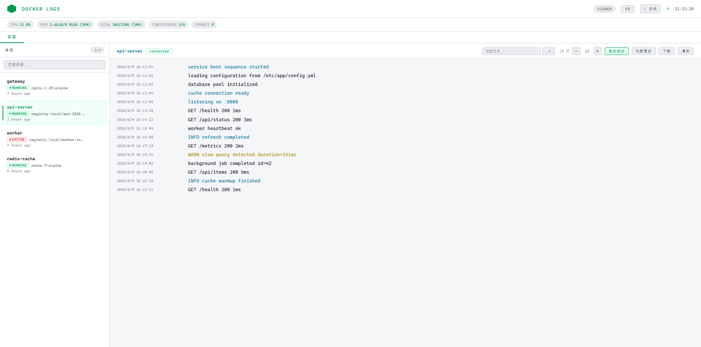

# Gaze Docker

> 一个轻量级的 Web Docker 管理面板。

[English](#english) | 中文

---



## 功能特性

- 📋 **容器管理** — 列表、启动、停止、重启、删除、查看详情
- 📡 **实时日志** — WebSocket 流式传输，支持关键字/正则过滤、高亮、下载
- 🖼️ **镜像管理** — 列表、删除、导入 .tar 包、浏览镜像内部文件目录
- 🚀 **部署服务** — 支持 docker-compose YAML 或 `docker run` 部署
- 📊 **资源监控** — CPU、内存、磁盘、容器/镜像数量实时展示
- 📝 **审计日志** — 记录所有管理员操作（镜像删除、部署、容器操作等）
- 🌐 **中英切换** — 界面支持中文/英文，默认中文
- 🔐 **密码认证** — 可选的 viewer/admin 角色认证，密码自动轮换
- 🛡️ **暴力破解防护** — 连续输错 10 次密码后进入假页面（展示 mock 数据）
- 🌗 **深色 / 浅色主题**

## 快速开始

### Docker Compose（推荐）

```bash
docker load -i gaze-docker.tar        # 使用离线镜像包时
docker compose -f docker-compose.example.yml up -d
```

打开 http://localhost:8080

### 直接运行

```bash
make build
./gaze-docker
```

### Docker 构建

```bash
docker build -t gaze-docker:local .
docker run -d -p 8080:8080 -v /var/run/docker.sock:/var/run/docker.sock gaze-docker:local
```

## 配置参数

| 参数 | 环境变量 | 默认值 | 说明 |
|------|---------|--------|------|
| `-port` | `PORT` | `8080` | Web 服务监听端口 |
| `-auth` | `AUTH` | `false` | 启用认证总开关（`true`/`1`） |
| `-viewer-auth` | `VIEWER_AUTH` | 跟随 AUTH | 启用 viewer 密码（只读角色） |
| `-admin-auth` | `ADMIN_AUTH` | 跟随 AUTH | 启用 admin 密码（完整管理） |
| `-auth-rotate` | `AUTH_ROTATE` | `1h` | 密码轮换周期（仅轮换已启用的身份） |

**权限模型**：viewer 只能查看（容器列表、日志、容器详情、性能监控），所有写操作（启停容器、镜像管理、部署、卷/网络、exec、清理等）仅 admin。view/admin 认证可独立开关，密码轮换跟随各自开关。

启用认证后，启动日志会显示已启用身份的临时密码：

```
[AUTH] viewer password: xxxx (valid for 1h)
[AUTH] admin  password: yyyy (valid for 1h)
```

| 角色 | 权限 |
|------|------|
| viewer | 查看容器和日志（敏感容器隐藏） |
| admin | 完整权限：镜像管理、部署、容器操作、审计日志 |

## 构建

```bash
make build              # 当前平台
make build-linux        # linux/amd64
make build-mac          # darwin/amd64
make build-mac-arm      # darwin/arm64

./build.sh              # 交互式菜单
./build.sh all          # 全平台构建
```

## 技术栈

- **后端**：Go 1.21，单文件（`main.go`）
- **前端**：原生 HTML/CSS/JS，通过 `//go:embed` 嵌入
- **运行时**：Docker CLI（调用 `docker ps`、`docker logs`、`docker compose` 等）

## 许可证

[MIT](LICENSE)

---

<a id="english"></a>

# Gaze Docker

> A lightweight web-based Docker management dashboard.

Chinese | [English](#english)

---


## Features

- 📋 **Container Management** — list, start, stop, restart, remove, inspect
- 📡 **Real-time Logs** — WebSocket streaming with keyword/regex filter, highlight, download
- 🖼️ **Image Management** — list, delete, load .tar, browse image filesystem
- 🚀 **Deploy** — deploy via docker-compose YAML or `docker run`
- 📊 **Resource Monitoring** — CPU, memory, disk, container/image counts
- 📝 **Audit Log** — tracks all admin operations (image delete, deploy, container actions)
- 🌐 **i18n** — Chinese / English UI toggle, defaults to Chinese
- 🔐 **Auth** — optional password auth with viewer/admin roles, auto-rotating passwords
- 🛡️ **Brute-force Protection** — 10 failed logins → fake page with mock data
- 🌗 **Dark / Light Theme**

## Quick Start

### Docker Compose (Recommended)

```bash
docker load -i gaze-docker.tar        # if using offline image
docker compose -f docker-compose.example.yml up -d
```

Open http://localhost:8080

### Binary

```bash
make build
./gaze-docker
```

### Docker Build

```bash
docker build -t gaze-docker:local .
docker run -d -p 8080:8080 -v /var/run/docker.sock:/var/run/docker.sock gaze-docker:local
```

## Configuration

| Flag | Env | Default | Description |
|------|-----|---------|-------------|
| `-port` | `PORT` | `8080` | Web server listening port |
| `-auth` | `AUTH` | `false` | Master auth switch (`true`/`1`) |
| `-viewer-auth` | `VIEWER_AUTH` | follows AUTH | Enable viewer password (read-only role) |
| `-admin-auth` | `ADMIN_AUTH` | follows AUTH | Enable admin password (full management) |
| `-auth-rotate` | `AUTH_ROTATE` | `1h` | Password rotation interval (only enabled roles are rotated) |

**Permissions**: viewer is read-only (container list, logs, inspect, perf monitoring). All write operations (start/stop containers, image management, deploy, volumes/networks, exec, prune) are admin-only. viewer/admin auth can be toggled independently; rotation follows each role's switch.

When auth is enabled, startup logs show temporary passwords for the enabled roles:

```
[AUTH] viewer password: xxxx (valid for 1h)
[AUTH] admin  password: yyyy (valid for 1h)
```

| Role | Capabilities |
|------|-------------|
| viewer | View containers and logs (sensitive containers hidden) |
| admin | Full access: images, deploy, container ops, audit |

## Build

```bash
make build              # current platform
make build-linux        # linux/amd64
make build-mac          # darwin/amd64
make build-mac-arm      # darwin/arm64

./build.sh              # interactive menu
./build.sh all          # all platforms
```

## Tech Stack

- **Backend**: Go 1.21, single file (`main.go`)
- **Frontend**: Vanilla HTML/CSS/JS, embedded via `//go:embed`
- **Runtime**: Docker CLI (shells out to `docker ps`, `docker logs`, `docker compose`, etc.)

## License

[MIT](LICENSE)
